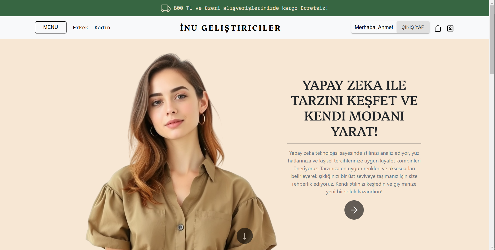
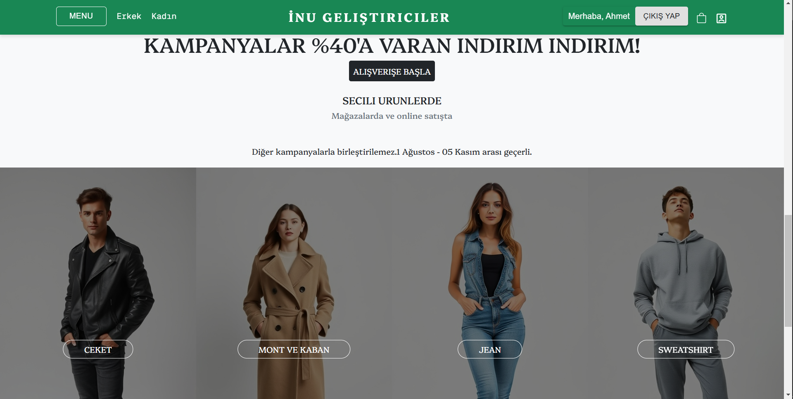
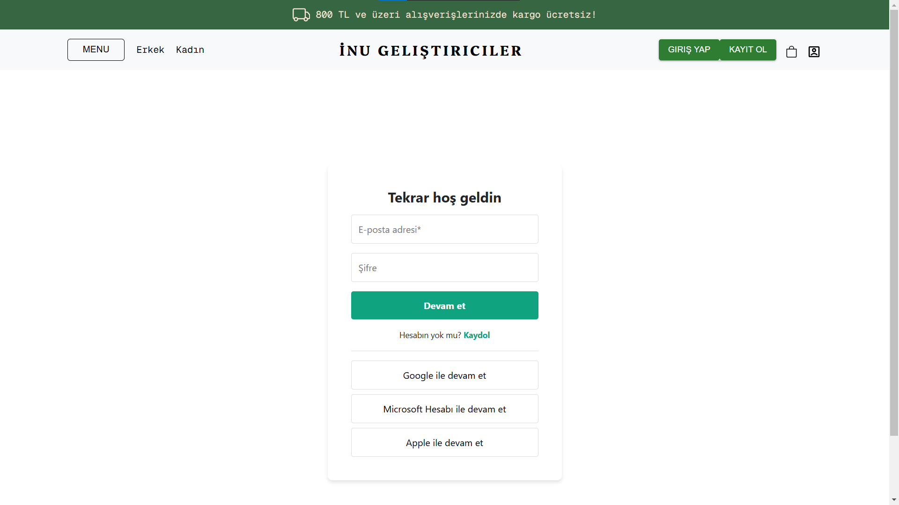
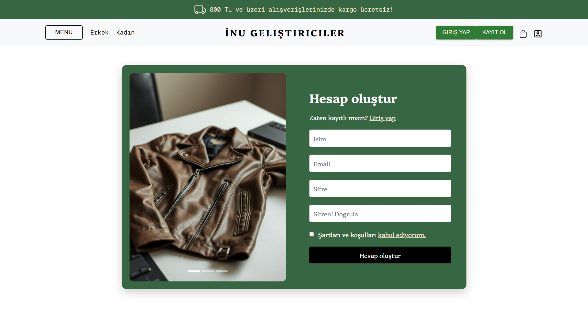
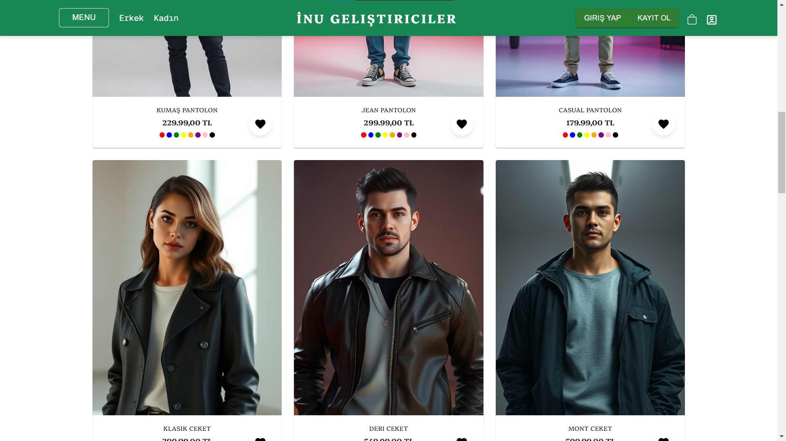
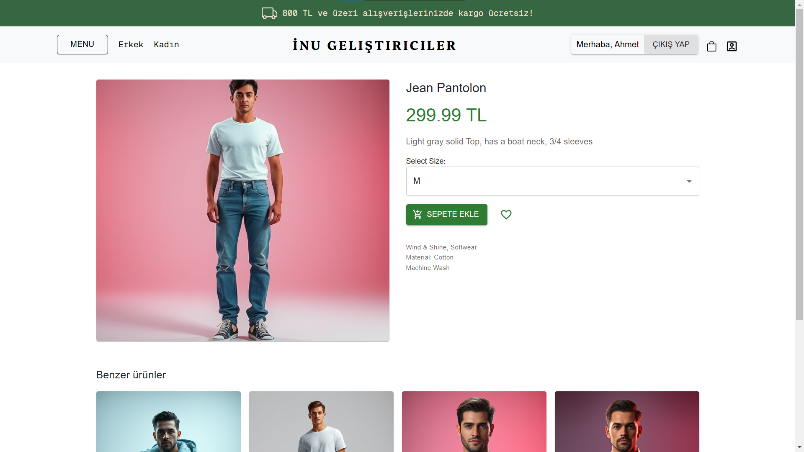
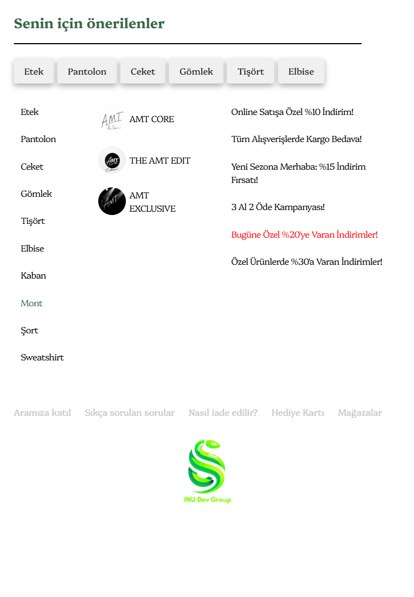
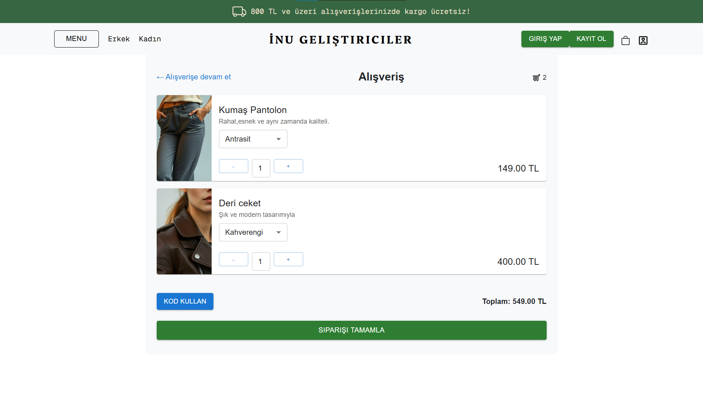

# Yapay Zeka Destekli Giyim Mağazası

**Yapay Zeka Destekli Giyim Mağazası**, kullanıcıların yaş, cinsiyet ve bireysel özelliklerini göz önünde bulundurarak en uygun kıyafet kombinlerini öneren bir platformdur. Bu proje, modern yapay zeka algoritmalarını ve kullanıcı dostu bir arayüzü birleştirerek kişiselleştirilmiş bir alışveriş deneyimi sunar.

---

## 📋 İçindekiler

- Proje Hakkında
- Özellikler
- Kurulum
- Kullanım
- Ekran Görüntülerü
- Yapılandırma
- Örnekler
- Sorun Giderme
- Katkıda Bulunanlar
- Lisans

---

## 🎯 Proje Hakkında

Yapay Zeka Destekli Giyim Mağazası, kişiselleştirilmiş bir alışveriş deneyimi sağlayarak aşağıdaki özellikleri sunmayı hedefler:

- Kullanıcılardan alınan yaş, cinsiyet, tarz tercihleri gibi veriler ışığında tavsiyeler oluşturur.
- Modern yapay zeka algoritmalarını kullanarak kullanıcı davranışlarını analiz eder.
- Kullanıcıların kıyafet seçimlerini kolaylaştıran kişiselleştirilmiş kombinler sunar.

---

##  📈 Proje Durumu 

**Projeye neler eklenecek?**

- Sepet sayfası arka uç ile bağlanıp dinamik hale getirilecek.
- Loading,skeleton gibi componentler eklenip tasarım detayları tamamlanacak.

---

## ✨ Özellikler

- **Kullanıcı Kimlik Doğrulaması**: Kayıt olun ve giriş yapın.
- **Resim Analizi**: Cinsiyet ve yaş tahmini için kullanıcının resminin yapay zeka destekli analizi.
- **Giyim Önerileri**: Tahmini yaş ve cinsiyete göre kişiselleştirilmiş giyim önerileri.
- **Modern Arayüz Tasarımı**: Önerilen giyim ürünlerini, promosyonları ve popüler ürünleri görüntüler.
- **Ürün Detayları**: Ürünler hakkında beden, renk ve fiyat gibi detaylı bilgileri görüntüleyin.
- **Ürün Kataloğu**: Ürünlerin listesini görüntüleyin, öğeleri arayın ve kategorilere göre filtreleyin.
- **Duyarlı Kullanıcı Arayüzü**: Farklı ekran boyutlarına uyarlanabilir düzenler.
- **Durum Yönetimi**: Verimli durum yönetimi için Riverpod'u kullanır.
- **Yapay Zeka Modeli Entegrasyonu**: Görüntü verilerini işlemek ve tahminler sağlamak için arka uç API'siyle iletişim kurar.

> **Not**: Bu proje, React`ta yapay zeka destekli uygulamaları keşfetmek, makine öğrenimi entegrasyonunu sağlamak ve e-ticaret uygulaması geliştirmek isteyen geliştiriciler için idealdir.

---

## 🚀 Kurulum

Projeyi çalıştırmak için aşağıdaki adımları izleyin:

1. **Depoyu Klonlayın**:
   
   ```bash
   git clone https://github.com/aydog4nn/Imagine-And-Combinations.git
   ```
2. **Proje Dizinine Gidin**:
   
   ```bash
   cd Imagine-And-Combinations.gitImagine-And-Combinations
   ```
3. **Paketleri Yükleyin**:
 
   ```bash
   npm install
   ```
4. **Uygulamayı Çalıştırın**:
 
   ```bash
   npm run dev
   ```

---

## 📸 Ekran Görüntüleri (Screenshots)

Aşağıda proje arayüzünden alınan ekran görüntüleri bulunmaktadır:

| **Ana Sayfa**                | **Ana Sayfa**                
|--------------------------------------|--------------------------------------|
|  |  

| **Giriş Yapma Sayfası**                | **Kayıt Olma Sayfası**                
|--------------------------------------|--------------------------------------|
|  |  

| **Ürünler Sayfası**                | **Ürün Detay Sayfası**                
|--------------------------------------|--------------------------------------|
|  |  

| **Yan Menü(Drawer)**                | **Sepet Sayfası**                
|--------------------------------------|--------------------------------------|
|  |  

---

## Kullanım

Uygulamayı keşfetmek için Flutter'ın run komutunu kullanarak yerel ortamınızda çalıştırmanız yeterlidir. Uygulama size bir e-ticaret deneyimi sağlayacaktır. Uygulama, görüntüyü işlemek ve cinsiyet ve yaş için tahminler sağlamak üzere bir arka uç AI modeliyle iletişim kurar. Arka uç [API](https://github.com/MASalmanss/Images-and-Combinations) deposunu burada bulabilirsiniz.

---

## Lisans


                                    
